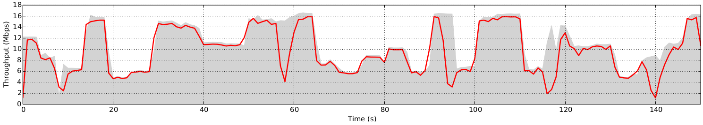
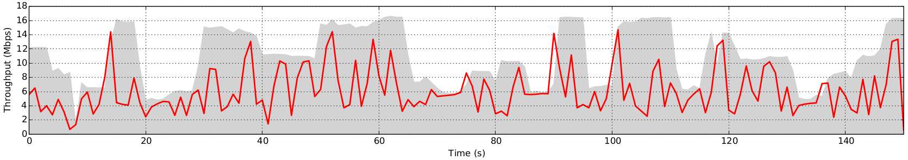
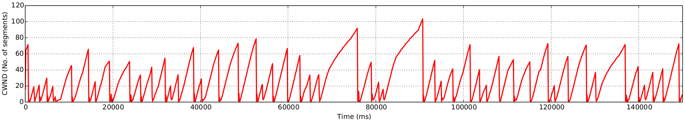

# TCP-Jia-Komiljon
TCP/IP implementation in C. Simulated using Mininet.

Sample throughput of TCP with near 0 loss.
<p align="center">
  
</p>

#### Base features
  * The sender sends packets based on a window.
  * The receiver sending cumulative acks to server.
  * When a sent packet is `acked`, the window slides and a new packet is transmitted from the sender.
  * All reading and writing operations are done directly to file using `fseek`

#### Buffering out of order packets

  * If the receiver receives an out of packet, the packet is buffered by writing to the location in disk.
  * A circular array is used to track the packets that have been acked.
  * On arrival of a new packet, if it completes a buffered sequence, then send cumulative ack.
  * If sender did not recieve ack within timeout window, it will re-send the packets.


#### Congestion mechanisms
1. **Slow start:**
  * The initial `ssthresh` is set to `64` segments.
  * During slow start, the `window_size` doubles each time a full window has been `acked`
  * Slow start continues until the `window_size` reaches `ssthresh` at which point we move to congestion avoidance
2. **Congestion avoidance:**
  * In this phase, `window_size` will increase by 1 each time a full window has been `acked`
3. **Fast retransmit:**
  * If the sender receives 3 `duplicate_ack` then `ssthresh` is set to half the `window_size` and window size is set to 1.

Plot of throughput and congestion window with a loss of 0.1%. The gray background is the current throughput of the network.
<p align="center">
  
</p>
<p align="center">
  
</p>

### Run instructions
To run the above simulation, first build from the source by navigating to `/rdt2.0/src` and running make.

Then, navigate to the root directory and run `sudo ./run.sh`. Make sure to place a file named `FILE` in the root directory. This will transfer to a new file named `FILE_RCVD`.

If you wish to run a checksum, ensure that the `FILE` is small enough or has enough time to fully be sent by the network. Then simply run `cksum FILE FILE_RCVD` in the root directory.

---
How to run mininet.

```
sudo mn --link tc,bw=10,delay=10ms,loss=2
mininet> xterm h1 h2
```

Terminal node h1

`./rdt2.0/obj/rdt_receiver 60001 FILE_RCVD`

Terminal node h2

`./rdt2.0/obj/rdt_sender 10.0.0.1 60001 small_file.bin`

Verifying checksum of the two files

`cksum FILE_RCVD small_file.bin`

---
